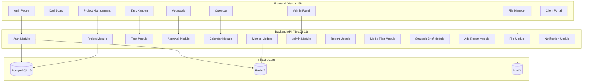
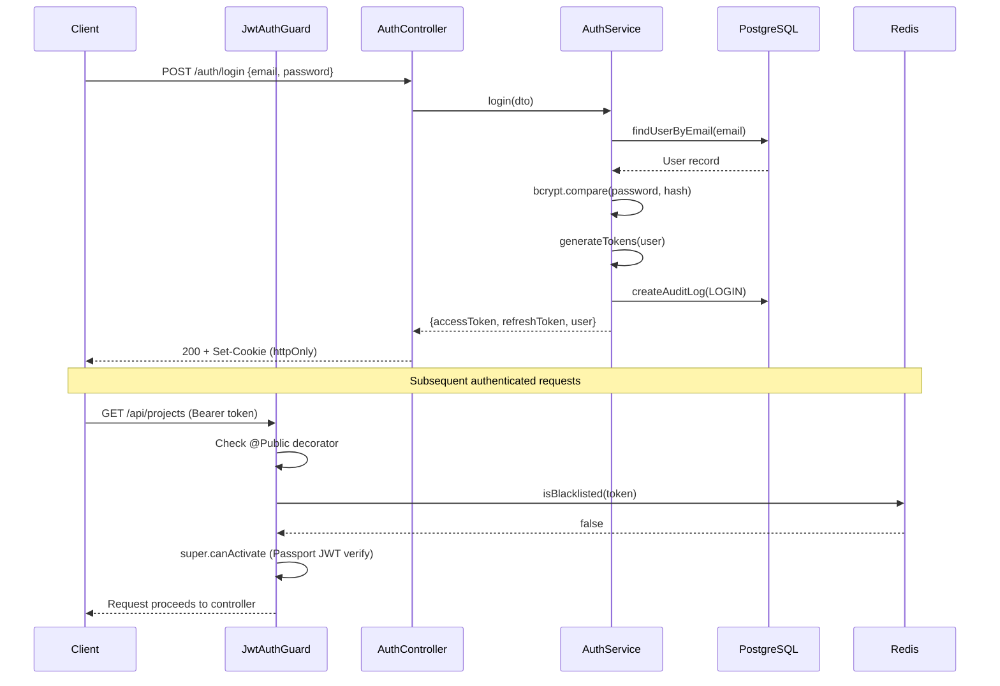
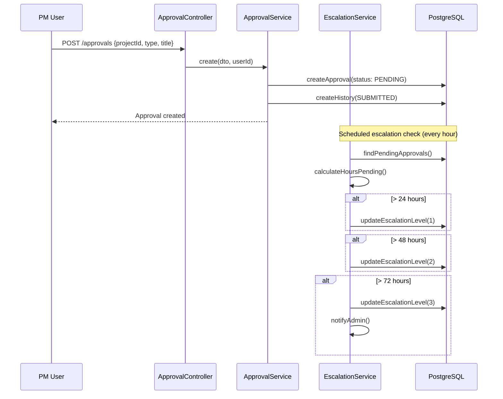
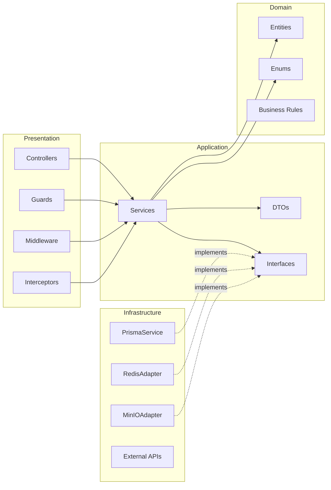
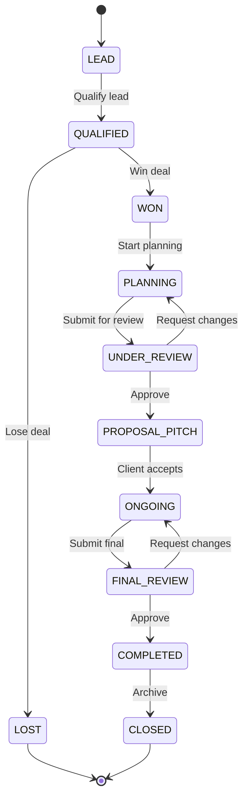
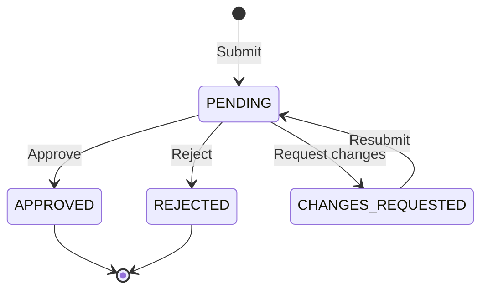
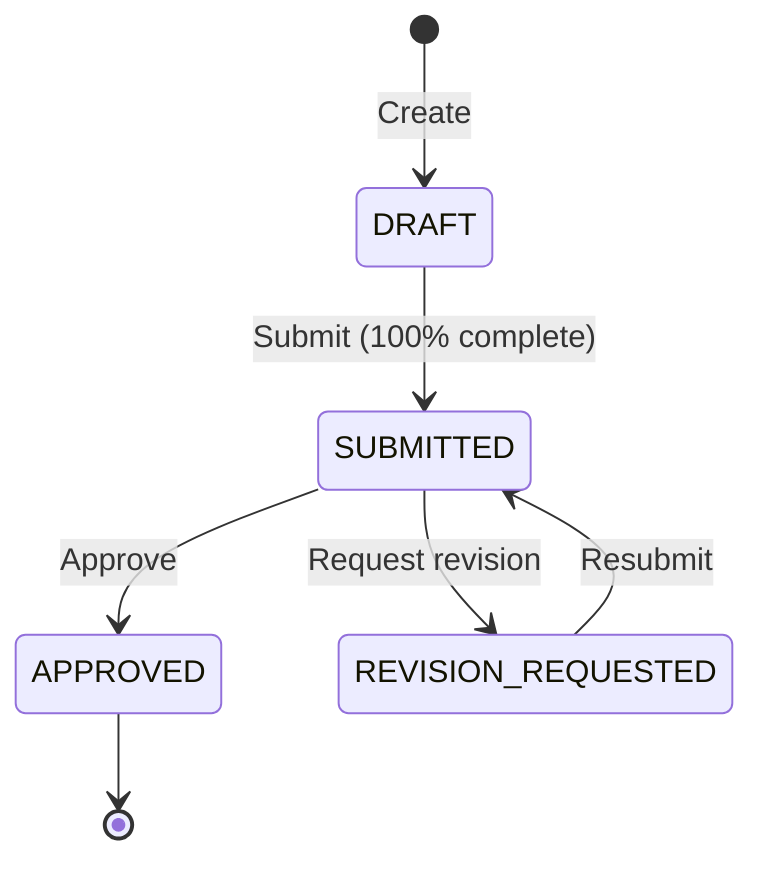
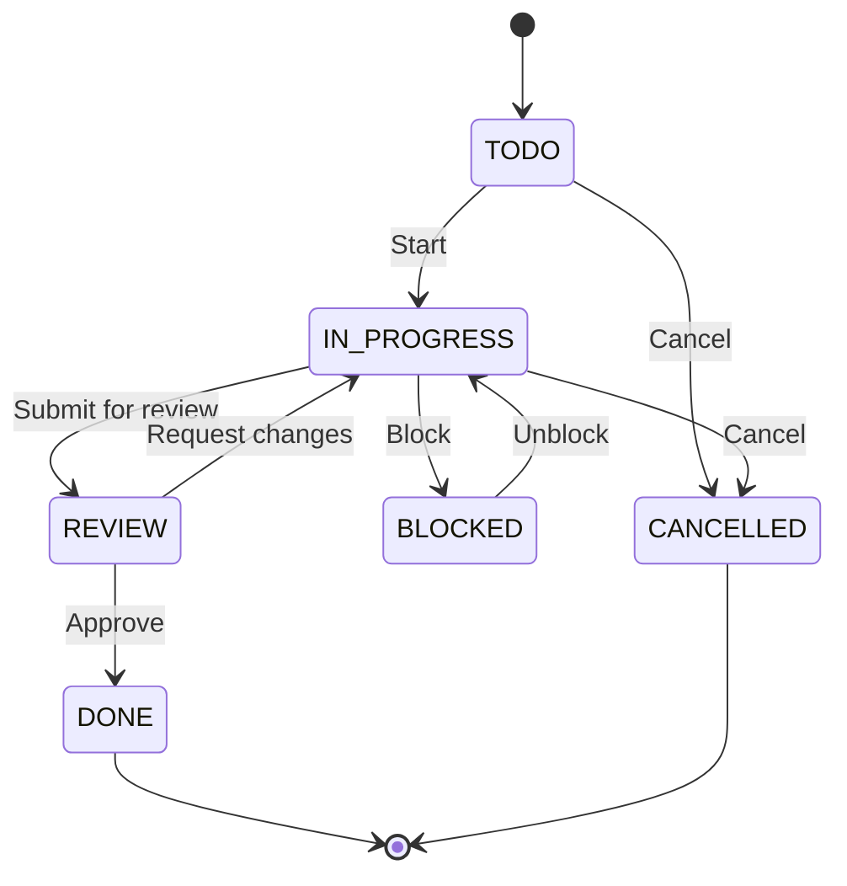

# Software Design Description (Architecture Document)

**IEEE 1016-2009 Compliant**

| Field            | Value                                         |
| ---------------- | --------------------------------------------- |
| **Project**      | PMS - Project Management System (BC Agency)   |
| **Document ID**  | PMS-SDD-001                                   |
| **Version**      | 1.1                                           |
| **Date**         | 2026-01-30                                    |
| **Author**       | Architecture Team - BC Agency                 |
| **Status**       | Approved                                      |

---

## Table of Contents

1. [Introduction](#1-introduction)
2. [System Overview](#2-system-overview)
3. [Architecture Pattern](#3-architecture-pattern)
4. [Directory Structure](#4-directory-structure)
5. [Data Design](#5-data-design)
6. [Component Design](#6-component-design)
7. [Interface Design](#7-interface-design)
8. [Security Design](#8-security-design)
9. [Deployment Architecture](#9-deployment-architecture)
10. [IEEE 1016 Design Viewpoints](#10-ieee-1016-design-viewpoints)
11. [Design Rationale](#11-design-rationale)
12. [Document Approval](#12-document-approval)

---

## 1. Introduction

### 1.1 Purpose

This Software Design Description (SDD) provides a comprehensive architectural overview of the PMS (Project Management System) developed for BC Agency. It describes the system's decomposition into components, the relationships between those components, data models, interfaces, security measures, and deployment topology.

This document serves as the primary architectural reference for all developers, reviewers, and stakeholders involved in the PMS project.

### 1.2 Scope

The PMS is a web-based project management system that enables BC Agency to manage advertising and media projects end-to-end. The system supports:

- Project lifecycle management from lead qualification through project closure
- Task management with Kanban boards and assignee tracking
- Multi-role approval workflows
- Calendar and event management
- File storage and document management
- Client portal access
- Administrative functions (user, client, and audit management)

### 1.3 Definitions and Acronyms

| Term   | Definition                                                                  |
| ------ | --------------------------------------------------------------------------- |
| PMS    | Project Management System - the system described in this document           |
| NVKD   | Nhan Vien Kinh Doanh - Sales/Business Development staff responsible for client relations and approvals |
| PM     | Project Manager - staff member responsible for project execution and delivery |
| DTO    | Data Transfer Object - object used to transfer data between layers          |
| ORM    | Object-Relational Mapping - abstraction layer for database access           |
| JWT    | JSON Web Token - standard for secure token-based authentication             |
| RBAC   | Role-Based Access Control                                                   |
| SPA    | Single Page Application                                                     |
| SSR    | Server-Side Rendering                                                       |

### 1.4 References

| Document                  | Source                             |
| ------------------------- | ---------------------------------- |
| IEEE 1016-2009            | IEEE Standard for Information Technology - Systems Design - Software Design Descriptions |
| PMS API Reference         | `docs/API.md`                     |
| PMS Deployment Guide      | `docs/DEPLOYMENT.md`              |
| PMS SQA Plan              | `docs/SQA_PLAN.md`               |
| Clean Architecture        | Robert C. Martin (ISBN 978-0134494166) |

---

## 2. System Overview

### 2.1 System Context Diagram

```
+-------------------+         HTTPS          +------------------+
|                   | ---------------------> |                  |
|  Client Browser   |                        |      Nginx       |
|  (SPA / SSR)      | <--------------------- | (Reverse Proxy)  |
|                   |         HTML/JSON       |   Port 80/443    |
+-------------------+                        +--------+---------+
                                                      |
                                     +----------------+----------------+
                                     |                                 |
                              /api/* routes                    /* static routes
                                     |                                 |
                            +--------v---------+            +----------v---------+
                            |                  |            |                    |
                            |  NestJS Backend  |            | Next.js Frontend   |
                            |  (REST API)      |            | (React SSR/SPA)    |
                            |  Port 3001       |            | Port 3000          |
                            |                  |            |                    |
                            +----+----+----+---+            +--------------------+
                                 |    |    |
                    +------------+    |    +-------------+
                    |                 |                  |
           +--------v------+  +------v-------+  +-------v-------+
           |               |  |              |  |               |
           |  PostgreSQL   |  |    Redis     |  |     MinIO     |
           |  (Database)   |  |   (Cache)    |  | (File Storage)|
           |  Port 5432    |  |  Port 6379   |  |  Port 9000    |
           |               |  |              |  |               |
           +---------------+  +--------------+  +---------------+
```

### 2.2 Technology Stack

| Layer              | Technology                | Version   | Purpose                              |
| ------------------ | ------------------------- | --------- | ------------------------------------ |
| Frontend Framework | Next.js                   | 15.x      | React framework with SSR/SSG support |
| Frontend Language  | TypeScript                | 5.x       | Type-safe JavaScript                 |
| Frontend Styling   | TailwindCSS               | 4.x       | Utility-first CSS framework          |
| Backend Framework  | NestJS                    | 11.x      | Enterprise Node.js framework         |
| Backend Language   | TypeScript                | 5.x       | Type-safe JavaScript                 |
| Database           | PostgreSQL                | 16        | Relational database                  |
| ORM                | Prisma                    | 7.x       | Type-safe database access            |
| Cache              | Redis                     | 7.x       | In-memory data store                 |
| Object Storage     | MinIO                     | latest    | S3-compatible file storage           |
| Reverse Proxy      | Nginx                     | latest    | HTTP reverse proxy & load balancer   |
| Containerization   | Docker + Docker Compose   | 24.x      | Container orchestration              |
| Authentication     | JWT (access + refresh)    | -         | Token-based authentication           |

---

## 3. Architecture Pattern

### 3.1 Clean Architecture

The PMS backend follows **Clean Architecture** (also known as Hexagonal Architecture / Ports and Adapters) with four concentric layers. Dependencies point strictly inward -- outer layers depend on inner layers, never the reverse.

```
+------------------------------------------------------------------+
|                      Presentation Layer                           |
|  (Controllers, Middleware, Guards, Pipes, API Routes)             |
+------------------------------------------------------------------+
|                      Application Layer                            |
|  (Use Cases, Services, DTOs, Interfaces/Ports)                   |
+------------------------------------------------------------------+
|                      Domain Layer                                 |
|  (Entities, Value Objects, Domain Events, Business Rules)         |
+------------------------------------------------------------------+
|                      Infrastructure Layer                         |
|  (Prisma Repositories, Redis Adapter, MinIO Adapter, External)   |
+------------------------------------------------------------------+
```

### 3.2 Layer Responsibilities

| Layer              | Responsibility                                              | Depends On        |
| ------------------ | ----------------------------------------------------------- | ----------------- |
| **Domain**         | Core business entities, value objects, domain rules. Zero external dependencies. | Nothing           |
| **Application**    | Use cases, service orchestration, DTO definitions, port interfaces (abstractions for infrastructure). | Domain            |
| **Infrastructure** | Concrete implementations of ports: database repositories (Prisma), cache (Redis), storage (MinIO), external APIs. | Application, Domain |
| **Presentation**   | HTTP controllers, request validation (pipes), authentication guards, middleware, API routing. | Application       |

### 3.3 Module Organization

The backend is organized into **feature modules**, each encapsulating its own layers:

```
Modules:
  +-- auth          (Authentication & authorization)
  +-- users         (User management)
  +-- clients       (Client management)
  +-- projects      (Project lifecycle)
  +-- tasks         (Task & subtask management)
  +-- approvals     (Approval workflow)
  +-- events        (Calendar & events)
  +-- files         (File upload & storage)
  +-- admin         (Administrative functions)
  +-- notifications (Alerts & notifications)
  +-- shared        (Cross-cutting concerns: guards, pipes, filters, utils)
```

### 3.4 Shared Module

The shared module contains cross-cutting concerns used across all feature modules:

- **Guards:** Authentication guard, role-based authorization guard
- **Pipes:** Validation pipe, parse UUID pipe
- **Filters:** Global exception filter, HTTP exception filter
- **Interceptors:** Logging interceptor, transform interceptor
- **Decorators:** Custom decorators (@CurrentUser, @Roles, @Public)
- **Utils:** Date helpers, string formatters, pagination helpers

---

## 4. Directory Structure

### 4.1 Backend Directory Structure

```
backend/
+-- src/
|   +-- main.ts                         # Application entry point
|   +-- app.module.ts                   # Root module
|   +-- common/                         # Shared/cross-cutting concerns
|   |   +-- decorators/                 # Custom decorators
|   |   |   +-- current-user.decorator.ts
|   |   |   +-- roles.decorator.ts
|   |   |   +-- public.decorator.ts
|   |   +-- guards/                     # Authentication & authorization
|   |   |   +-- jwt-auth.guard.ts
|   |   |   +-- roles.guard.ts
|   |   +-- pipes/                      # Validation & transformation
|   |   |   +-- validation.pipe.ts
|   |   |   +-- parse-uuid.pipe.ts
|   |   +-- filters/                    # Exception handling
|   |   |   +-- http-exception.filter.ts
|   |   +-- interceptors/               # Request/response transformation
|   |   |   +-- logging.interceptor.ts
|   |   |   +-- transform.interceptor.ts
|   |   +-- utils/                      # Helper functions
|   |       +-- pagination.util.ts
|   |       +-- date.util.ts
|   +-- modules/                        # Feature modules
|   |   +-- auth/
|   |   |   +-- auth.module.ts
|   |   |   +-- auth.controller.ts      # Presentation layer
|   |   |   +-- auth.service.ts         # Application layer
|   |   |   +-- strategies/             # Passport strategies
|   |   |   +-- dto/                    # Data transfer objects
|   |   |   +-- interfaces/             # Port definitions
|   |   +-- users/
|   |   |   +-- users.module.ts
|   |   |   +-- users.controller.ts
|   |   |   +-- users.service.ts
|   |   |   +-- entities/               # Domain entities
|   |   |   +-- dto/
|   |   |   +-- repositories/           # Infrastructure (Prisma)
|   |   +-- projects/
|   |   |   +-- projects.module.ts
|   |   |   +-- projects.controller.ts
|   |   |   +-- projects.service.ts
|   |   |   +-- entities/
|   |   |   +-- dto/
|   |   |   +-- enums/                  # Project status/stage enums
|   |   |   +-- repositories/
|   |   +-- tasks/
|   |   |   +-- tasks.module.ts
|   |   |   +-- tasks.controller.ts
|   |   |   +-- tasks.service.ts
|   |   |   +-- entities/
|   |   |   +-- dto/
|   |   |   +-- repositories/
|   |   +-- approvals/
|   |   |   +-- approvals.module.ts
|   |   |   +-- approvals.controller.ts
|   |   |   +-- approvals.service.ts
|   |   |   +-- entities/
|   |   |   +-- dto/
|   |   |   +-- repositories/
|   |   +-- events/
|   |   |   +-- events.module.ts
|   |   |   +-- events.controller.ts
|   |   |   +-- events.service.ts
|   |   |   +-- dto/
|   |   |   +-- repositories/
|   |   +-- files/
|   |   |   +-- files.module.ts
|   |   |   +-- files.controller.ts
|   |   |   +-- files.service.ts
|   |   |   +-- storage/               # MinIO adapter
|   |   |   +-- dto/
|   |   +-- admin/
|   |   |   +-- admin.module.ts
|   |   |   +-- admin.controller.ts
|   |   |   +-- admin.service.ts
|   |   |   +-- dto/
|   |   +-- notifications/
|   |       +-- notifications.module.ts
|   |       +-- notifications.service.ts
|   |       +-- channels/              # Email, Telegram, etc.
|   +-- prisma/                         # Database schema & migrations
|       +-- schema.prisma
|       +-- migrations/
|       +-- seed.ts
+-- test/                               # Tests
|   +-- unit/
|   +-- integration/
|   +-- e2e/
|   +-- fixtures/
+-- Dockerfile
+-- tsconfig.json
+-- jest.config.ts
+-- .eslintrc.js
```

### 4.2 Frontend Directory Structure

```
frontend/
+-- src/
|   +-- app/                            # Next.js App Router
|   |   +-- (auth)/                     # Auth route group
|   |   |   +-- login/page.tsx
|   |   |   +-- layout.tsx
|   |   +-- (dashboard)/                # Authenticated route group
|   |   |   +-- projects/
|   |   |   |   +-- page.tsx            # Project list
|   |   |   |   +-- [id]/page.tsx       # Project detail
|   |   |   |   +-- new/page.tsx        # Create project
|   |   |   +-- tasks/
|   |   |   |   +-- page.tsx
|   |   |   |   +-- kanban/page.tsx
|   |   |   +-- approvals/
|   |   |   |   +-- page.tsx
|   |   |   +-- calendar/
|   |   |   |   +-- page.tsx
|   |   |   +-- files/
|   |   |   |   +-- page.tsx
|   |   |   +-- admin/
|   |   |   |   +-- users/page.tsx
|   |   |   |   +-- clients/page.tsx
|   |   |   |   +-- audit-logs/page.tsx
|   |   |   +-- layout.tsx              # Dashboard layout (sidebar)
|   |   +-- layout.tsx                  # Root layout
|   |   +-- globals.css
|   +-- components/                     # Shared UI components
|   |   +-- ui/                         # Base components (buttons, inputs)
|   |   +-- layout/                     # Layout components (sidebar, header)
|   |   +-- projects/                   # Project-specific components
|   |   +-- tasks/                      # Task-specific components
|   |   +-- approvals/                  # Approval-specific components
|   +-- hooks/                          # Custom React hooks
|   |   +-- use-auth.ts
|   |   +-- use-projects.ts
|   |   +-- use-tasks.ts
|   +-- lib/                            # Utilities and configurations
|   |   +-- api.ts                      # API client (fetch wrapper)
|   |   +-- auth.ts                     # Auth helpers
|   |   +-- utils.ts                    # General utilities
|   +-- types/                          # TypeScript type definitions
|   |   +-- project.types.ts
|   |   +-- task.types.ts
|   |   +-- user.types.ts
|   |   +-- approval.types.ts
|   +-- stores/                         # State management
|       +-- auth.store.ts
|       +-- project.store.ts
+-- public/                             # Static assets
+-- Dockerfile
+-- next.config.ts
+-- tailwind.config.ts
+-- tsconfig.json
```

---

## 5. Data Design

### 5.1 Database Technology

| Property          | Value                                                |
| ----------------- | ---------------------------------------------------- |
| **DBMS**          | PostgreSQL 16                                        |
| **ORM**           | Prisma 7                                             |
| **Migrations**    | Prisma Migrate (version-controlled SQL migrations)   |
| **Connection**    | Connection pooling via Prisma (pool size configurable)|
| **Backup**        | Automated daily pg_dump with 30-day retention         |

### 5.2 Entity Relationship Overview

```
+----------+       +----------+       +----------+
|   User   |------>| TeamMember|<------| Project  |
+----------+       +----------+       +-----+----+
     |                                       |
     |              +----------+             |
     +------------->|   Task   |<------------+
     |  (assignee)  +----+-----+             |
     |                   |                   |
     |              +----v-----+             |
     |              | Subtask  |             |
     |              +----------+             |
     |                                       |
     |              +----------+             |
     +------------->| Approval |<------------+
     | (submitter/  +----------+
     |  approver)        |
     |              +----v---------+
     |              | ApprovalHist |
     |              +--------------+
     |
     |              +----------+       +----------+
     +------------->|  Event   |<------| Attendee |
     |              +----------+       +----------+
     |
     |              +----------+
     +------------->|   File   |
     |              +----------+
     |
     |              +----------+
     +------------->| AuditLog |
                    +----------+

+----------+       +----------+
|  Client  |------>| Project  |
+----------+       +----------+
```

### 5.3 Key Entities

| Entity            | Description                                              | Key Fields                                                                 |
| ----------------- | -------------------------------------------------------- | -------------------------------------------------------------------------- |
| **User**          | Internal staff member                                    | id, email, name, role, avatar, isActive, passwordHash                      |
| **Client**        | External client organization                             | id, email, companyName, contactName, phone, address, taxCode, isActive     |
| **Project**       | Advertising/media project                                | id, code, name, status, stage, stageProgress, startDate, endDate, clientId |
| **TeamMember**    | User assigned to a project with a role                   | id, userId, projectId, role, isPrimary                                     |
| **Task**          | Work item within a project                               | id, projectId, parentId, title, status, priority, estimatedHours, deadline |
| **TaskAssignee**  | User assigned to a task                                  | id, taskId, userId                                                         |
| **Approval**      | Approval request for project deliverables                | id, projectId, type, status, title, submittedById, approvedById, deadline  |
| **ApprovalHistory**| Status change record for an approval                    | id, approvalId, fromStatus, toStatus, comment, changedById, changedAt      |
| **Event**         | Calendar event (meeting, deadline, milestone)             | id, title, type, startTime, endTime, isAllDay, recurrence, projectId       |
| **EventAttendee** | User attending an event                                  | id, eventId, userId, email, name, status                                   |
| **File**          | Uploaded file/document                                   | id, name, path, size, mimeType, category, version, projectId, uploadedById |
| **AuditLog**      | System audit trail entry                                 | id, userId, action, entityType, entityId, metadata, ipAddress              |

### 5.4 Enumerations

**User Roles:**

| Value           | Description                            |
| --------------- | -------------------------------------- |
| `SUPER_ADMIN`   | Full system access                     |
| `ADMIN`         | Administrative access                  |
| `NVKD`          | Sales/Business Development staff       |
| `PM`            | Project Manager                        |
| `DESIGNER`      | Designer                               |
| `DEVELOPER`     | Developer                              |
| `ACCOUNT`       | Account Manager                        |

**Project Status:**

| Value         | Description                              |
| ------------- | ---------------------------------------- |
| `ACTIVE`      | Currently active project                 |
| `ON_HOLD`     | Temporarily paused                       |
| `COMPLETED`   | Successfully completed                   |
| `CANCELLED`   | Cancelled/terminated                     |

**Project Stage (Lifecycle):**

| Value             | Description                              |
| ----------------- | ---------------------------------------- |
| `PLANNING`        | Initial planning phase                   |
| `UNDER_REVIEW`    | Awaiting approval                        |
| `PROPOSAL_PITCH`  | Proposal/pitch to client                 |
| `ONGOING`         | Active execution                         |
| `FINAL_REVIEW`    | Final review before completion           |
| `COMPLETED`       | Delivered and closed                     |

**Task Status:**

| Value          | Description                               |
| -------------- | ----------------------------------------- |
| `TODO`         | Not yet started                           |
| `IN_PROGRESS`  | Currently being worked on                 |
| `REVIEW`       | Awaiting review                           |
| `DONE`         | Completed                                 |
| `BLOCKED`      | Blocked by dependency                     |
| `CANCELLED`    | Cancelled                                 |

**Task Priority:**

| Value    | Description         |
| -------- | ------------------- |
| `LOW`    | Low priority        |
| `MEDIUM` | Medium priority     |
| `HIGH`   | High priority       |
| `URGENT` | Urgent priority     |

**Approval Status:**

| Value               | Description                        |
| ------------------- | ---------------------------------- |
| `PENDING`           | Awaiting review                    |
| `APPROVED`          | Approved by reviewer               |
| `REJECTED`          | Rejected by reviewer               |
| `CHANGES_REQUESTED` | Changes requested before approval  |

**Approval Type:**

| Value      | Description                |
| ---------- | -------------------------- |
| `PLAN`     | Project plan approval      |
| `DESIGN`   | Design deliverable approval|
| `PROPOSAL` | Proposal/pitch approval    |
| `OTHER`    | Other approval type        |

---

## 6. Component Design

### 6.1 Authentication Flow

```
+--------+     POST /auth/login      +----------+     Validate        +-----------+
| Client | -----------------------> | Auth      | -----------------> | User      |
| Browser|                          | Controller|                    | Service   |
+--------+                          +----------+                    +-----------+
    ^                                    |                               |
    |                                    |    Compare bcrypt hash        |
    |                                    |<------------------------------+
    |                                    |
    |           JWT Pair                 |    Generate tokens
    |   (access + refresh)               |    (access: 1h, refresh: 7d)
    |<-----------------------------------+
    |                                    |
    |   Set httpOnly cookies             |    Set-Cookie headers
    |   - access_token (1h)              |    (httpOnly, secure,
    |   - refresh_token (7d,             |     sameSite: strict)
    |     path: /api/auth/refresh)       |
    |<-----------------------------------+
```

**Authentication Steps:**

1. User submits email + password via `POST /auth/login`
2. Auth controller delegates to auth service
3. Auth service looks up user by email, verifies password with bcrypt comparison
4. On success, generates a JWT pair:
   - **Access token:** 1-hour expiry, contains user ID and role
   - **Refresh token:** 7-day expiry, contains user ID only
5. Tokens are returned in the response body AND set as httpOnly cookies
6. Subsequent requests include the access token via `Authorization: Bearer <token>` header or cookie
7. When the access token expires, the client calls `POST /auth/refresh` with the refresh token
8. On logout, tokens are blacklisted in Redis and cookies are cleared

### 6.2 Project Lifecycle

```
  +--------+      +------------+      +---------+
  |  LEAD  | ---> |  QUALIFIED | ---> |   WON   | ----+
  +--------+      +-----+------+      +---------+     |
                        |                              |
                        v                              v
                  +----------+               +---------+--------+
                  |   LOST   |               |     PLANNING     |
                  +----------+               +---------+--------+
                                                       |
                                             Submit for approval
                                                       |
                                                       v
                                             +---------+--------+
                                             |   UNDER_REVIEW   |
                                             +---------+--------+
                                                       |
                                          +------------+------------+
                                          |            |            |
                                       Approve      Reject    Req. Changes
                                          |            |            |
                                          v            v            |
                                   +------+----+ +----+-----+      |
                                   | PROPOSAL/ | | PLANNING |      |
                                   |   PITCH   | | (revert) |      |
                                   +------+----+ +----------+      |
                                          |                        |
                                       Approve                     |
                                          |                        |
                                          v                        |
                                   +------+----+                   |
                                   |  ONGOING   | <----------------+
                                   +------+----+    (after changes)
                                          |
                                    Final review
                                          |
                                          v
                                   +------+------+
                                   | FINAL_REVIEW|
                                   +------+------+
                                          |
                                       Approve
                                          |
                                          v
                                   +------+----+
                                   | COMPLETED  |
                                   +------+----+
                                          |
                                       Archive
                                          |
                                          v
                                   +------+----+
                                   |  CLOSED   |
                                   +-----------+
```

**Lifecycle Description:**

1. **LEAD:** Initial contact/opportunity identified by NVKD
2. **QUALIFIED:** Lead evaluated and deemed worth pursuing
3. **WON/LOST:** Sales outcome -- WON leads become projects, LOST leads are archived
4. **PLANNING:** PM creates project plan, assigns team, defines tasks
5. **UNDER_REVIEW:** Plan submitted for NVKD/admin approval
6. **PROPOSAL_PITCH:** Approved plan presented to client
7. **ONGOING:** Active project execution with task management
8. **FINAL_REVIEW:** Deliverables reviewed before client handoff
9. **COMPLETED:** Project delivered and accepted
10. **CLOSED:** Project archived for records

### 6.3 Approval Workflow

```
   PM submits approval
          |
          v
   +------+------+
   |   PENDING    | --------------------+
   +------+------+                      |
          |                             |
   +------+------+------+              |
   |      |             |              |
Approve  Reject   Req. Changes         |
   |      |             |              |
   v      v             v              |
+--+---+ +--+----+ +---+-----------+   |
|APPROV| |REJECT | |CHANGES_REQUEST|   |
|ED    | |ED     | +---+-----------+   |
+------+ +-------+     |              |
                   Resubmit            |
                        |              |
                        +--------------+
                     (back to PENDING)
```

**Approval Rules:**

- Only PM (project member) or Admin can submit approvals
- Only NVKD, Admin, or Super Admin can approve/reject/request changes
- Rejection requires a mandatory comment
- Request Changes allows resubmission (status resets to PENDING)
- Each status transition is recorded in ApprovalHistory with timestamp, actor, and comment
- Approval triggers project stage advancement
- Rejection reverts project stage to PLANNING

### 6.4 Project Phase Structure (4-Phase Model)

Projects follow a 4-phase execution structure:

| Phase | Vietnamese Name      | English Name          | Description                                                    |
| ----- | -------------------- | --------------------- | -------------------------------------------------------------- |
| 1     | KHOI_TAO_PLAN        | Initialization & Plan | Project setup, requirements gathering, plan creation, team assignment |
| 2     | SETUP_CHUAN_BI       | Setup & Preparation   | Environment setup, design work, resource preparation, tool configuration |
| 3     | VAN_HANH_TOI_UU      | Operation & Optimize  | Active execution, task completion, optimization, iterative delivery |
| 4     | TONG_KET             | Summary & Closure     | Final review, deliverable handoff, lessons learned, project archival |

**Phase Progression:**

```
Phase 1              Phase 2              Phase 3              Phase 4
KHOI_TAO_PLAN  --->  SETUP_CHUAN_BI --->  VAN_HANH_TOI_UU ---> TONG_KET
(Planning)           (Preparation)        (Execution)          (Closure)
```

Each phase has:
- Defined entry criteria (what must be true to start)
- Defined exit criteria (what must be completed to move on)
- Associated task templates
- Approval gates between phases

---

## 7. Interface Design

### 7.1 RESTful API Design

| Property                | Value                                   |
| ----------------------- | --------------------------------------- |
| **Architecture Style**  | RESTful                                 |
| **Base Path**           | `/api`                                  |
| **API Documentation**   | Swagger UI at `/api/docs`               |
| **API Spec Format**     | OpenAPI 3.0                             |
| **Authentication**      | JWT Bearer token via `Authorization` header |
| **Content Type**        | `application/json` (default)            |
| **File Upload**         | `multipart/form-data`                   |
| **Pagination**          | Offset-based (`page`, `limit`)          |
| **Sorting**             | `sortBy`, `sortOrder` (asc/desc)        |
| **Filtering**           | Query parameters per endpoint           |
| **Error Format**        | `{ statusCode, message, error }`        |

### 7.2 API Endpoint Summary

| Module      | Endpoints                     | Methods                 | Auth Required |
| ----------- | ----------------------------- | ----------------------- | ------------- |
| Auth        | `/api/auth/*`                 | POST                    | Partial       |
| Projects    | `/api/projects/*`             | GET, POST, PATCH, DELETE| Yes           |
| Tasks       | `/api/tasks/*`                | GET, POST, PATCH, DELETE| Yes           |
| Approvals   | `/api/approvals/*`            | GET, POST, PATCH        | Yes           |
| Events      | `/api/events/*`               | GET, POST, PATCH, DELETE| Yes           |
| Files       | `/api/files/*`                | GET, POST, PATCH, DELETE| Yes           |
| Admin       | `/api/admin/*`                | GET, POST, PATCH        | Yes (Admin+)  |

### 7.3 API Versioning Strategy

- Current version: v1 (implicit, no version prefix)
- Future versions will use URL prefix: `/api/v2/...`
- Breaking changes require a new version; non-breaking changes are added to current version

### 7.4 Rate Limiting

| Endpoint Category   | Limit                    |
| ------------------- | ------------------------ |
| Authentication      | 5 requests/minute        |
| General API         | 100 requests/minute      |
| File Upload         | 10 requests/minute       |

Rate limit information is returned in response headers: `X-RateLimit-Limit`, `X-RateLimit-Remaining`, `X-RateLimit-Reset`.

---

## 8. Security Design

### 8.1 Security Measures Overview

| Security Layer          | Implementation                                                                    |
| ----------------------- | --------------------------------------------------------------------------------- |
| **HTTP Headers**        | Helmet.js -- sets security headers (X-Frame-Options, X-Content-Type-Options, etc.) |
| **CORS**                | Strict origin whitelist; credentials allowed only from approved frontend origins   |
| **CSRF Protection**     | CSRF token validation for state-changing requests from browser clients             |
| **Rate Limiting**       | Per-IP and per-user rate limits enforced at Nginx and application level            |
| **Input Validation**    | class-validator + class-transformer on all DTOs; Prisma parameterized queries      |
| **Authentication**      | JWT access/refresh token pair with httpOnly, secure, sameSite cookies              |
| **Token Blacklisting**  | Revoked tokens stored in Redis with TTL matching token expiry                      |
| **Password Hashing**    | bcrypt with configurable salt rounds (default: 12)                                 |
| **Audit Logging**       | All sensitive operations logged with user ID, action, entity, IP address, timestamp |
| **SQL Injection**       | Prevented by Prisma ORM parameterized queries; no raw SQL without explicit review  |
| **XSS Prevention**      | React auto-escaping + Content-Security-Policy headers + input sanitization          |
| **File Upload Security**| MIME type validation, file size limits (50MB), virus scanning (future), isolated storage |

### 8.2 Authentication Token Design

```
Access Token (JWT):
{
  "sub": "user-uuid",          // User ID
  "email": "user@bcagency.com",
  "role": "PM",                // User role for RBAC
  "iat": 1706000000,           // Issued at
  "exp": 1706003600            // Expires in 1 hour
}

Refresh Token (JWT):
{
  "sub": "user-uuid",          // User ID
  "jti": "unique-token-id",    // Token ID for blacklisting
  "iat": 1706000000,
  "exp": 1706604800            // Expires in 7 days
}
```

### 8.3 Role-Based Access Control (RBAC)

```
SUPER_ADMIN > ADMIN > NVKD / PM / ACCOUNT > DESIGNER / DEVELOPER
```

| Operation                | SUPER_ADMIN | ADMIN | NVKD | PM  | DESIGNER | DEVELOPER | ACCOUNT |
| ------------------------ | ----------- | ----- | ---- | --- | -------- | --------- | ------- |
| Manage users             | Yes         | Yes*  | No   | No  | No       | No        | No      |
| Manage clients           | Yes         | Yes   | No   | No  | No       | No        | Yes     |
| Create project           | Yes         | Yes   | Yes  | Yes | No       | No        | No      |
| Approve/reject           | Yes         | Yes   | Yes  | No  | No       | No        | No      |
| Manage tasks             | Yes         | Yes   | No   | Yes | Yes      | Yes       | No      |
| Upload files             | Yes         | Yes   | Yes  | Yes | Yes      | Yes       | Yes     |
| View audit logs          | Yes         | Yes   | No   | No  | No       | No        | No      |

*Admin cannot create or modify other Admin/Super Admin accounts.

### 8.4 Data Protection

- All communication encrypted via TLS 1.2+ (enforced by Nginx)
- Passwords hashed with bcrypt (never stored in plaintext)
- JWT secrets stored in environment variables (never in code)
- Sensitive configuration managed via `.env` files (excluded from version control)
- Database credentials rotated quarterly
- File storage access via pre-signed URLs with 1-hour expiry

---

## 9. Deployment Architecture

### 9.1 Docker Compose Topology

```
+---------------------------------------------------------------+
|                     Docker Compose Network                     |
|                                                               |
|  +----------+    +----------+    +----------+    +----------+ |
|  |          |    |          |    |          |    |          | |
|  | Nginx    |--->| Frontend |--->| Backend  |--->|PostgreSQL| |
|  | :80/:443 |    | :3000    |    | :3001    |    | :5432    | |
|  |          |    |          |    |          |    |          | |
|  +----------+    +----------+    +----+-----+    +----------+ |
|                                       |                       |
|                                  +----+-----+    +----------+ |
|                                  |          |    |          | |
|                                  |  Redis   |    |  MinIO   | |
|                                  |  :6379   |    | :9000    | |
|                                  |          |    | :9001    | |
|                                  +----------+    +----------+ |
+---------------------------------------------------------------+
```

### 9.2 Service Configuration

| Service      | Image / Build         | Ports (Host:Container) | Volumes                    | Health Check                     |
| ------------ | --------------------- | ---------------------- | -------------------------- | -------------------------------- |
| **nginx**    | nginx:latest          | 80:80, 443:443         | nginx.conf, ssl certs      | `curl -f http://localhost/`      |
| **frontend** | Build from Dockerfile | 3000:3000              | -                          | `curl -f http://localhost:3000/` |
| **backend**  | Build from Dockerfile | 3001:3001              | -                          | `curl -f http://localhost:3001/api/health` |
| **postgres** | postgres:16           | 5433:5432              | pgdata (named volume)      | `pg_isready -U bc_user`         |
| **redis**    | redis:7-alpine        | 6380:6379              | redis-data (named volume)  | `redis-cli ping`                |
| **minio**    | minio/minio           | 9000:9000, 9001:9001   | minio-data (named volume)  | `curl -f http://localhost:9000/minio/health/live` |

### 9.3 Nginx Reverse Proxy Configuration

```
Request Routing:
  /api/*       --> backend:3001    (NestJS API)
  /api/docs    --> backend:3001    (Swagger UI)
  /*           --> frontend:3000   (Next.js App)

SSL Termination:
  HTTPS (443) --> Nginx --> HTTP (internal)
  HTTP  (80)  --> 301 redirect to HTTPS

Security Headers:
  X-Frame-Options: DENY
  X-Content-Type-Options: nosniff
  X-XSS-Protection: 1; mode=block
  Strict-Transport-Security: max-age=31536000
  Content-Security-Policy: default-src 'self'
```

### 9.4 Environment Configuration

| Environment  | Database                    | Cache          | Storage        | Domain                  |
| ------------ | --------------------------- | -------------- | -------------- | ----------------------- |
| Development  | PostgreSQL (Docker, :5433)  | Redis (Docker) | MinIO (Docker) | localhost               |
| Staging      | PostgreSQL (Docker)         | Redis (Docker) | MinIO (Docker) | staging.pms.bcagency.com|
| Production   | PostgreSQL (Docker/managed) | Redis (Docker) | MinIO (Docker) | pms.bcagency.com        |

---

## 10. IEEE 1016 Design Viewpoints

*The following viewpoints comply with IEEE 1016-2009 Section 5: Design Viewpoints.*

### 10.1 Composition Viewpoint

The system is composed of the following major subsystems:



### 10.2 Logical Viewpoint

#### Authentication Sequence



#### Approval Workflow Sequence



### 10.3 Dependency Viewpoint



**Dependency rule:** Arrows point inward only. Infrastructure implements interfaces defined by Application layer.

### 10.4 Information Viewpoint

See [Data Dictionary](./DATA_DICTIONARY.md) for complete entity documentation. Key data flows:

| Data Flow | Source | Destination | Format | Trigger |
|---|---|---|---|---|
| User authentication | Client | Auth Module → PostgreSQL | JWT + bcrypt hash | Login request |
| Token blacklisting | Auth Module | Redis | Token hash + TTL | Logout request |
| Project creation | PM | Project Module → PostgreSQL | Project DTO | API call |
| File upload | User | File Module → MinIO | Multipart form | Upload request |
| Approval decision | NVKD/Admin | Approval Module → PostgreSQL | Status + comment | Approve/Reject |
| Budget tracking | PM | BudgetEvent → PostgreSQL | Amount + type | Budget event creation |
| Metrics collection | Interceptor | Prometheus | Counter/Histogram | Every HTTP request |

### 10.5 Patterns Viewpoint

| Pattern | Where Applied | Rationale |
|---|---|---|
| **Repository** | MediaPlan module | Full Clean Architecture separation; injectable mock for testing |
| **Service Layer** | All modules | Business logic encapsulation; single responsibility |
| **Guard Pattern** | Auth, Roles, ClientAuth | Cross-cutting authentication/authorization; declarative via decorators |
| **Interceptor** | Metrics | Cross-cutting concerns (logging, metrics) without polluting business logic |
| **Middleware** | CSRF | Request-level concerns before routing |
| **DTO Pattern** | All API endpoints | Input validation (class-validator) + type safety at API boundary |
| **Factory Pattern** | Project phases, Brief sections | Create standard structures (4 phases, 16 brief sections) |
| **State Machine** | Project lifecycle, Brief, Approval | Enforce valid state transitions via `canTransition()` methods |
| **Escalation** | Approval workflow | Time-based escalation (24h/48h/72h) for stale approvals |

### 10.6 State Dynamics Viewpoint

#### Project Stage State Machine



#### Approval Status State Machine



#### Strategic Brief Status State Machine



#### Task Status State Machine



### 10.7 Algorithm Viewpoint

#### Budget Threshold Calculation

```
function getThreshold(projectId):
    project = findProject(projectId)
    if not project or project.totalBudget == 0:
        return { level: 'ok', percent: 0 }

    percent = round((project.spentAmount / project.totalBudget) * 100)

    if percent >= 100: level = 'critical'
    else if percent >= 80: level = 'warning'
    else: level = 'ok'

    return { level, percent }
```

#### Completion Percentage Calculation (Strategic Brief)

```
function recalculateCompletion(briefId):
    sections = findSections(briefId)  // 16 sections
    completedCount = sections.filter(s => s.isComplete).length
    percentage = round((completedCount / sections.length) * 100)
    updateBrief(briefId, { completionPct: percentage })
    return percentage
```

#### Approval Escalation Algorithm

```
function checkEscalation(approval):
    hoursPending = (now - approval.createdAt) / 3600000

    if hoursPending >= 72 and approval.escalationLevel < 3:
        escalate(approval, level=3)  // Notify ADMIN
    else if hoursPending >= 48 and approval.escalationLevel < 2:
        escalate(approval, level=2)  // Notify PM lead
    else if hoursPending >= 24 and approval.escalationLevel < 1:
        escalate(approval, level=1)  // Notify reviewer
```

### 10.8 Resource Viewpoint

| Resource | Allocation | Scaling Strategy | Monitoring |
|---|---|---|---|
| **CPU** | 2 vCPU per container | Horizontal (Docker replicas) | Prometheus node_exporter |
| **Memory** | Backend: 512MB, Frontend: 256MB, DB: 1GB | Vertical (increase limits) | Prometheus process metrics |
| **Storage (DB)** | 10GB initial, auto-grow | Vertical + partitioning | `pg_stat_database` |
| **Storage (Files)** | 50GB MinIO | Horizontal (add buckets/nodes) | MinIO metrics |
| **Connections (DB)** | Pool size: 10 (configurable) | Increase pool via env var | Prisma metrics |
| **Redis Memory** | 256MB max | Eviction policy: allkeys-lru | Redis INFO memory |
| **Network** | Internal Docker network | Nginx load balancing | Prometheus `httpRequestDuration` |

### 10.9 Architecture Decision Records

All significant architecture decisions are documented as ADRs in [`docs/adr/`](./adr/):

| ADR | Title | Status |
|---|---|---|
| [ADR-0001](./adr/0001-clean-architecture-pattern.md) | Clean Architecture Pattern | Accepted |
| [ADR-0002](./adr/0002-nestjs-framework-selection.md) | NestJS Framework Selection | Accepted |
| [ADR-0003](./adr/0003-prisma-orm-selection.md) | Prisma ORM Selection | Accepted |
| [ADR-0004](./adr/0004-jwt-authentication-strategy.md) | JWT Authentication Strategy | Accepted |
| [ADR-0005](./adr/0005-unified-project-entity.md) | Unified Project Entity | Accepted |
| [ADR-0006](./adr/0006-media-plan-repository-pattern.md) | Media Plan Repository Pattern | Accepted |

---

## 11. Design Rationale

This section documents key architectural decisions and their rationale. Full details are available in the Architecture Decision Records (ADRs) located in `docs/adr/`.

### 11.1 Why Clean Architecture?

**Decision:** Adopt Clean Architecture (domain → application → infrastructure → presentation) for the media-plan module as a reference implementation.

**Rationale:** Separating business rules from framework concerns enables independent testability and future migration flexibility. The NestJS module system naturally aligns with bounded contexts.

**ADR:** [0001-clean-architecture-pattern](adr/0001-clean-architecture-pattern.md)

### 11.2 Why NestJS over Express/Fastify?

**Decision:** Use NestJS as the backend framework.

**Rationale:** NestJS provides opinionated structure (modules, providers, decorators), built-in DI container, first-class TypeScript support, and a rich ecosystem (Passport, Swagger, Schedule). This reduces boilerplate and enforces consistent patterns across the team.

**ADR:** [0002-nestjs-framework-selection](adr/0002-nestjs-framework-selection.md)

### 11.3 Why Prisma over TypeORM/Drizzle?

**Decision:** Use Prisma 7 as the ORM with PostgreSQL.

**Rationale:** Prisma's declarative schema (`schema.prisma`) serves as the single source of truth for the data model. Type-safe client generation eliminates runtime type errors. Migration system provides auditable database evolution. The trade-off is less flexibility for complex raw SQL, mitigated by Prisma's `$queryRaw` escape hatch.

**ADR:** [0003-prisma-orm-selection](adr/0003-prisma-orm-selection.md)

### 11.4 Why JWT in HTTP-only Cookies?

**Decision:** Store JWT access tokens in HTTP-only, Secure, SameSite cookies instead of localStorage.

**Rationale:** HTTP-only cookies prevent XSS-based token theft. Combined with CSRF double-submit cookies, this provides defense-in-depth. Token blacklisting via Redis handles logout/revocation. The trade-off is increased complexity for CSRF handling, but the security improvement justifies it.

**ADR:** [0004-jwt-authentication-strategy](adr/0004-jwt-authentication-strategy.md)

### 11.5 Why a Unified Project Entity?

**Decision:** Use a single `Project` model with 50+ fields spanning the entire lifecycle (LEAD→CLOSED) rather than separate Sales/Project entities.

**Rationale:** The agency workflow naturally transitions a deal into a project - splitting the entity would require complex data migration at the transition point. The unified model enables a single API surface and consistent querying. Nullable fields for stage-specific data (evaluation costs, project codes) are acceptable given the workflow.

**ADR:** [0005-unified-project-entity](adr/0005-unified-project-entity.md)

### 11.6 Why Repository Pattern for Media Plans?

**Decision:** Implement the Repository pattern with DI token injection (`MEDIA_PLAN_REPOSITORY`) for the media-plan module.

**Rationale:** This demonstrates Clean Architecture's port/adapter pattern - the domain defines a repository interface, and the infrastructure provides the Prisma implementation. This enables: (1) easy testing with in-memory repositories, (2) potential future migration to a different data store, (3) separation of query optimization from business logic.

**ADR:** [0006-media-plan-repository-pattern](adr/0006-media-plan-repository-pattern.md)

### 11.7 Why Auto-Escalation for Approvals?

**Decision:** Implement automatic escalation with 3 levels (24h reminder → 48h PM escalation → 72h Admin escalation) using NestJS `@Cron`.

**Rationale:** Advertising agency deadlines are tight. Unapproved items block creative production and media buying. Automated escalation ensures no approval request goes unnoticed beyond business SLAs. The escalation thresholds are centralized in `business-rules.ts` for easy adjustment.

---

## 12. Document Approval

| Role              | Name           | Signature   | Date       |
| ----------------- | -------------- | ----------- | ---------- |
| Architect         | ______________ | ___________ | __________ |
| Dev Team Lead     | ______________ | ___________ | __________ |
| Project Manager   | ______________ | ___________ | __________ |

---

**Document History:**

| Version | Date       | Author           | Changes                               |
| ------- | ---------- | ---------------- | ------------------------------------- |
| 1.0     | 2026-01-30 | Architecture Team| Initial architecture document creation |
| 1.1     | 2026-01-30 | Architecture Team| Added IEEE 1016 viewpoints (10.1-10.9): Composition, Logical, Dependency, Information, Patterns, State Dynamics, Algorithm, Resource; ADR references; Mermaid diagrams |
| 1.2     | 2026-01-30 | Architecture Team| Added Section 11: Design Rationale (7 decisions with ADR references) |

---

*This document follows IEEE 1016-2009: IEEE Standard for Information Technology -- Systems Design -- Software Design Descriptions.*
